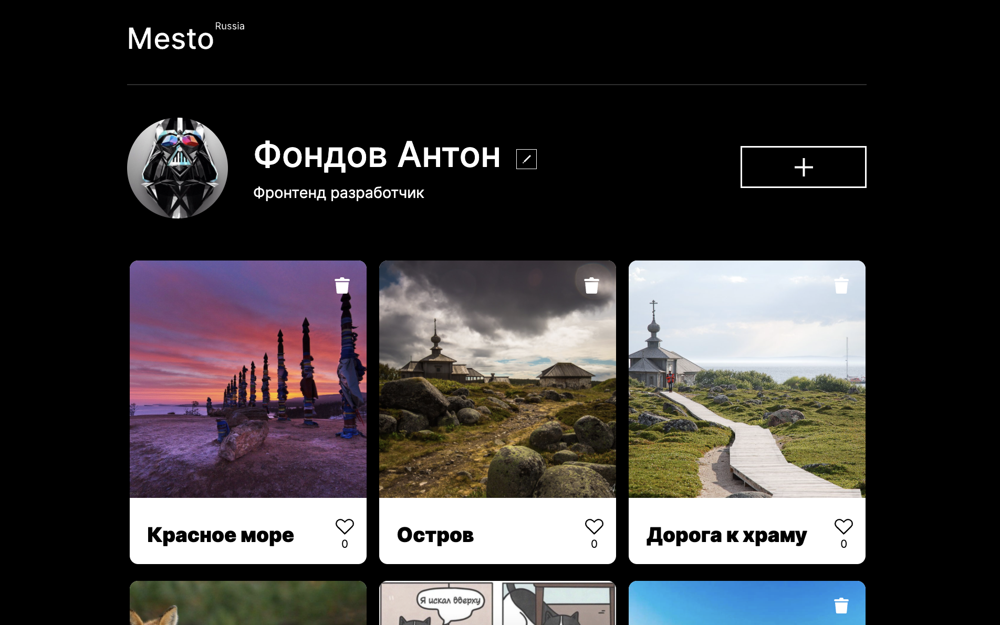

# Проект: Место
Сайт посвящен разным красивым местам России, которые стоило посетить

### Функциональность

* На сайте реализоано спомощью javaScript интерактивность в виде изменения Имени пользователя и его профессии

* Реалезовано скрытие лишнего текста многоточием при слишком длинных названиях

* Так же сайт адаптирован под разные разрешения включая мобильные устройства.

[ Ссылка на сайт](https://000ren000.github.io/mesto/)
